


<a href="https://github.com/VincesHu01">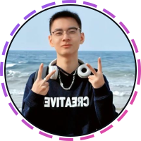</a>

 

 

<a href="https://github.com/VincesHu01">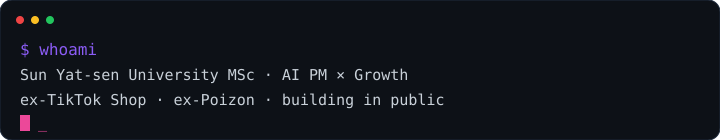</a>

  

[`ABOUT`](#about) · [`LATEST BUILDS`](#latest-builds) · [`SHIPPED`](#shipped-systems) · [`STACK`](#capability-map) · [`SIGNAL`](#signal-dashboard) · [`CONNECT`](#connect)

 

## 🧑‍💻 About

I'm **VincesHu (Hu Zhongyue)** — a Master's candidate at **Sun Yat-sen University** working where **AI, product, and growth** overlap.

I turn fuzzy user problems into software people can actually use. My operating loop is simple:

> **find the friction → model the workflow → build the system → ship → learn from reality**

I have shipped real product and operations work at **TikTok Shop** and **Poizon**, and I now build AI agents, local-first tools, automation systems, and product intelligence workflows in public.

## ⚡ Latest Builds

<table>
  <tr>
    <td width="50%" valign="top">
      <a href="https://github.com/VincesHu01/wps-ppt-recolor">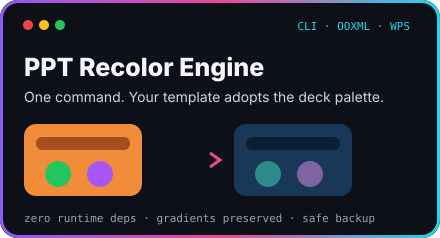</a>
       
      <b>PPT Recolor Engine</b> 
      Reads the palette a deck actually uses, then remaps pasted diagrams, gradients and charts without flattening their visual hierarchy.
        
      <a href="https://github.com/VincesHu01/wps-ppt-recolor"><code>VIEW SOURCE →</code></a>
    </td>
    <td width="50%" valign="top">
      <a href="https://github.com/VincesHu01/academic-deliverables">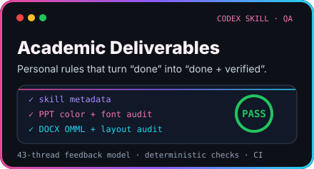</a>
       
      <b>Academic Deliverables Skill</b> 
      Turns 43 threads of real revision feedback into reusable production rules and deterministic PPTX/DOCX quality checks.
        
      <a href="https://github.com/VincesHu01/academic-deliverables"><code>VIEW SOURCE →</code></a>
    </td>
  </tr>
</table>

## 🚀 Shipped Systems

<a href="https://github.com/VincesHu01/timeless-career-intelligence#gh-light-mode-only"></a>
<a href="https://github.com/VincesHu01/timeless-career-intelligence#gh-dark-mode-only"></a>
<a href="https://github.com/VincesHu01/ai-news-aggregator#gh-light-mode-only"></a>
<a href="https://github.com/VincesHu01/ai-news-aggregator#gh-dark-mode-only"></a>

 

<a href="https://github.com/VincesHu01/Apex-workbench#gh-light-mode-only"></a>
<a href="https://github.com/VincesHu01/Apex-workbench#gh-dark-mode-only"></a>
<a href="https://github.com/VincesHu01/douji#gh-light-mode-only"></a>
<a href="https://github.com/VincesHu01/douji#gh-dark-mode-only"></a>

<b>🧭 The product thesis behind each system</b>

- **[timeless-career-intelligence](https://github.com/VincesHu01/timeless-career-intelligence)** — turns scattered hiring signals into a role ability map and focused learning path.
- **[ai-news-aggregator](https://github.com/VincesHu01/ai-news-aggregator)** — compresses information overload into the few AI signals that actually matter.
- **[Apex-workbench](https://github.com/VincesHu01/Apex-workbench)** — a beautiful, zero-account life dashboard for people who dislike bloated SaaS.
- **[douji](https://github.com/VincesHu01/douji)** — indexes local Doubao history and jumps directly to the exact matching conversation turn.

## 🪐 Capability Map

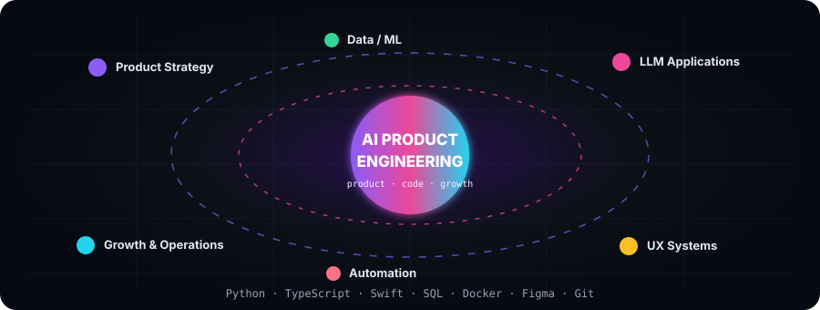

<b>🛠️ Expand the full stack</b>

### Core languages

### AI, ML and data

### Shipping tools

## 📡 Signal Dashboard

 

  

  

## 🐍 Contribution Snake

## 🌱 Now


## ✦ ChatGPT Token Telemetry

<a href="https://chatgpt.com/u/vinceshu01">
  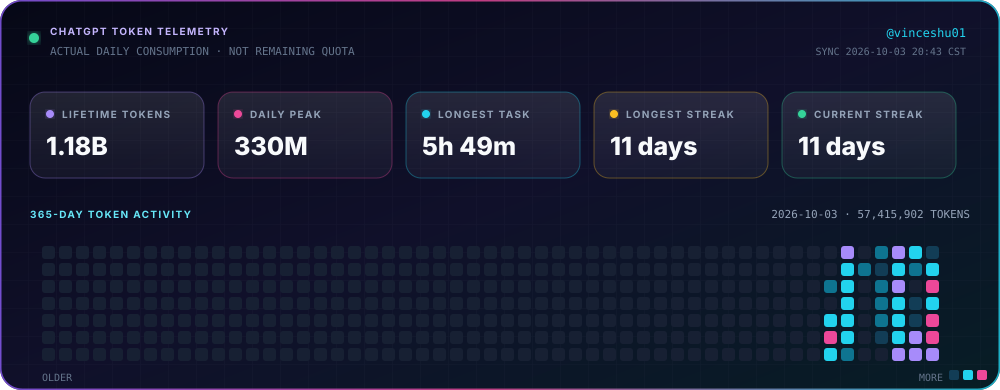
</a>

Tracks actual Work / Codex token consumption by day — not remaining quota. Automatically refreshed from my ChatGPT profile analytics.

## 🔗 Connect

  

© 2026 VincesHu · designed as a living product, not a static résumé

